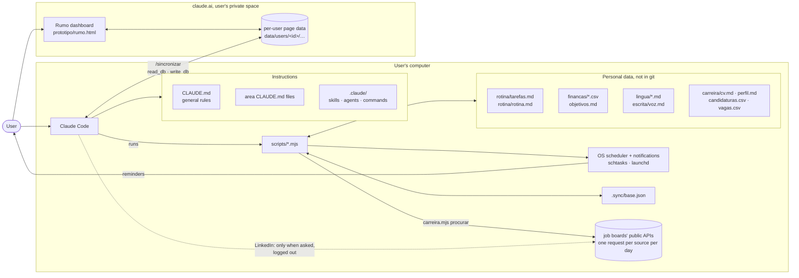
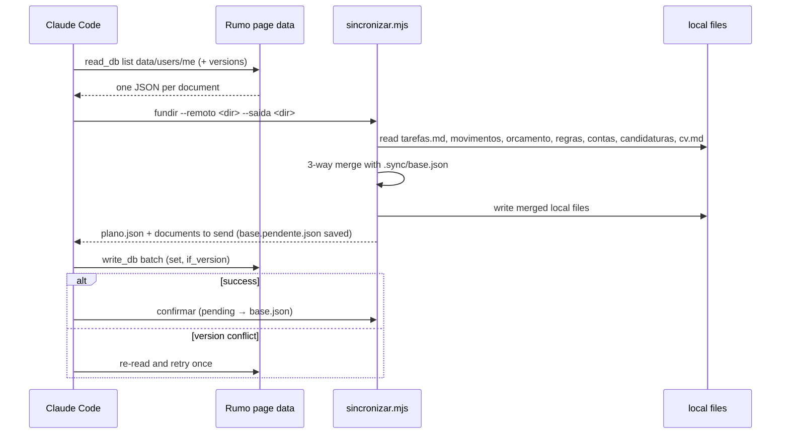

# Architecture

Rumo is a personal assistant that runs inside **Claude Code**, with a companion web **dashboard on claude.ai** and an optional local version of the same dashboard. It has no remote server, no database of its own and no npm dependencies. `painel.mjs` can start a temporary localhost server so the browser can edit an explicit allow-list of local personal files.

- **Instructions:** Markdown files that tell Claude how to behave (`CLAUDE.md`, skills, agents and commands).
- **Data:** plain-text files (Markdown and CSV) that the user owns and that stay on their computer.
- **Scripts:** small Node scripts that do anything mechanical (counting, dates, money, merging), so the model never does arithmetic.

The main design goal is **focus and trust**. The user gets lost when topics mix and loses trust when facts are invented. Most of the structure below exists to prevent those two failures.

## Overview



## 1. Instruction layer: how focus is enforced

| layer | file(s) | loaded | role |
|---|---|---|---|
| General rules | `CLAUDE.md` | always | area map and four rules: one area per conversation, never invent facts, the user decides, tone |
| Area rules | `rotina/`, `financas/`, `carreira/`, `pensar/`, `lingua/`, `escrita/` → `CLAUDE.md` | only when working in that folder | the files the area owns, its principles and what it must not do |
| Skills | `.claude/skills/<name>/SKILL.md` (31) | on demand | step-by-step procedures (`planear-dia`, `financas-registo`, `avaliar-vaga`, `corretor-pt`…) |
| Agents | `.claude/agents/<name>.md` (12) | when delegated | Escrita specialists with restricted tools (critics can't edit the manuscript) |
| Commands | `.claude/commands/<name>.md` (34) | when typed | `/hoje`, `/gastos`, `/vaga`… Each one declares its area and points to a skill or script |
| Settings | `.claude/settings.json` | always | allow-listed scripts, `git push` asks first, `scripts/data/` is read-only, startup hook |

Every command starts by declaring its area (`[Área: Rotina]`). Because area rules only load inside that folder, a conversation about finances never sees the writing rules or data, and vice versa.

**Rule 2 (never invent)** is enforced in three ways:
- **Tags:** answers mark their facts with `[Verificado: source, date]`, `[Provável]`, `[Incerto]`, `[Opinião]` or `[Não sei]`.
- **Web research:** figures about the world (rates, taxes, laws) must come from a WebSearch or WebFetch, with the source.
- **Scripts:** the user's own numbers come only from their files, and any total is computed by a script.

## 2. Areas

| area | data it owns | script | commands |
|---|---|---|---|
| Rotina | `tarefas.md`, `rotina.md`, `revisoes/` | `rotina.mjs`, `lembretes.mjs` | `/hoje` `/foco` `/feito` `/captura` `/travado` `/semana` `/lembretes` |
| Finanças | `movimentos/AAAA-MM.csv`, `regras.csv`, `orcamento.csv`, `contas.csv`, `objetivos.md`, `notas/` | `financas.mjs` | `/gastos` `/financas` `/investir` |
| Carreira | `cv.md`, `perfil.md`, `fontes.csv`, `candidaturas.csv`, `vagas.csv`, `relatorios/` | `carreira.mjs` | `/procurar` `/vaga` `/candidaturas` |
| Pensar | `conversas/`, `notas/` | none | `/pensar` |
| Língua | `erros-frequentes.md`, `glossario.md` | none | `/pt` `/en` |
| Escrita | `voz.md`, `projetos/<slug>/…`, `templates/` | `cwos.mjs` | `/rever` for standalone texts; `/brief` `/critique` `/continuity` `/draft`… for projects |

Escrita also contains a full creative-writing system: canon statuses, a timeline, scene sheets, quality gates and editorial agents. It is documented separately in [escrita/docs/architecture.md](../escrita/docs/architecture.md).

## 3. Data layer

Everything is plain text that the user can open and edit.

- **Tasks:** one Markdown line per task, with inline tokens:
  ```text
  - [ ] Pagar renda !1 @casa ^2026-10-08 ≈15m *mensal ~2 id:abc123
  ```
  - `!1` priority, `@casa` context, `^date` deadline, `≈15m` estimate;
  - `*mensal` repeat: marking the task done creates the next one;
  - `~2` how many times it was postponed: 3 or more flags the task as stuck;
  - `id:` the sync identifier.
- **Money:** semicolon-separated CSV files with Portuguese number formats. Expenses are negative, and transfers between the user's own accounts are excluded from totals.

**Privacy:**
- **Personal files are never committed.** The repository holds only a `*.modelo.*` template next to each personal file (for example `rotina/tarefas.modelo.md` or `financas/regras.modelo.csv`).
- **Personal copies are created on first use.** The scripts copy the template when the file is missing, and the assistant is told to do the same.
- **Data leaves the computer in only two ways:** when the user uses the dashboard, and when they run `/sincronizar`. In both cases it goes to the user's own private claude.ai space.

## 4. Scripts

All scripts are ES modules with no dependencies (Node ≥ 18). Each one works both as a CLI and as a library for the tests. Setting `ASSISTENTE_ROOT` (or `CWOS_ROOT` for `cwos.mjs`) points a script at a temporary folder, which is how the tests run in isolation.

| script | responsibility |
|---|---|
| `rotina.mjs` | parse and write tasks; `hoje` (at most 3 focus items, overdue, due today, stuck tasks); `captura`, `adiar`, `feito` (recurring tasks); `semana`; `arranque` (startup line); `lembrete <kind>` (reminder text) |
| `lembretes.mjs` | OS notifications (PowerShell toast on Windows, `osascript` on macOS, `notify-send` on Linux); installs the scheduled reminders with `schtasks` (through a `.vbs` launcher, so no window opens) or `launchd`; focus timer (a detached process) |
| `financas.mjs` | import bank CSVs (detects the separator, preamble lines, debit/credit columns; skips duplicates); `categorizar` from the rules file; `resumo` (budget, what's left per day, trends); `recorrentes`; `patrimonio` (flags old balances) |
| `carreira.mjs` | job search: `procurar` (sources from `fontes.csv`, with optional one-off word/location filters), `novas`, `guardar`, `adicionar`, `mudar`, `lista`, `resumo`, `agenda` (see §5) |
| `painel.mjs` | runs the local dashboard: `abrir` (starts it in the background with no window and opens the browser), `parar`, `estado`, `servir`. Serves the page on `127.0.0.1` and exposes token-protected endpoints for the personal files, the day's emails and agenda, the saved postings, the Claude bridge and the usage limits (see §6) |
| `sincronizar.mjs` | three-way merge between local files and the dashboard (see §7) |
| `atalho.mjs` | draws the compass logo into `prototipo/rumo.ico` and creates the Windows `Rumo` shortcut, which opens the panel with no console window |
| `cwos.mjs` | Escrita: `new`/`use`/`add` projects and entities, `validate`, `index`, `deps`, `context`, `wc`, `mentions`, `style`, `cliches`, `canon-diff` |

**Startup hook:** when Claude Code opens, `.claude/settings.json` runs `rotina.mjs arranque`. It prints the day's priorities as a `systemMessage`, which the user sees and the model does not. It never fails, even when there is no task file.

**Reminders:** the OS scheduler runs `rotina.mjs lembrete manha|prazo|tarde|semana --notificar` (morning, deadline, evening and weekly). The text is produced deterministically by the script, with no model call.

## 5. Job search (Carreira)

The shape of the area — a requirement-by-requirement evaluation, a single tracker, legitimacy checks — comes from [career-ops](https://github.com/career-ops-hq/career-ops) (MIT). The implementation shares no code with it: career-ops drives a headless browser and a Go TUI, and Rumo has no dependencies.

**Sources.** `carreira/fontes.csv` holds one line per query (`fonte;alvo;nome;palavras;local`). Nine sources are read through their public APIs, with `fetch` and no browser:

| source | what it covers | notes |
|---|---|---|
| `landing`, `itjobs` | Portuguese tech jobs | ITJobs needs a free key in `ITJOBS_API_KEY`; without it the source is skipped, not failed |
| `greenhouse`, `ashby`, `lever` | one company's own board | `alvo` is the company's identifier in its careers URL; these three don't return a company name, so it comes from `nome` |
| `remotive`, `remoteok`, `arbeitnow`, `himalayas` | remote and European listings | Remotive's filter parameters are ignored by the public feed, so filtering happens locally |

Each line is queried **at most once every 20 hours** (`carreira/.procura.json` holds the timestamps). That is what Remotive asks for (up to four calls a day) and more than enough for the rest; every posting keeps its original link and its source, which is what Remotive and Remote OK require for attribution.

**LinkedIn is deliberately not a source.** It has no public jobs API, and its user agreement forbids automated collection — with the user's own account at risk. It is searched only when the user asks, logged out, through `procurar-vagas`: one WebSearch, and at most one read of the public results page.

**Deduplication** is by source id and by `empresa|cargo` folded to letters and digits, so the same job found on two sources, or already in the tracker, is only offered once.

**The tracker** is `carreira/candidaturas.csv`, one line per application, with states `guardada → candidatei → entrevista → proposta → aceite` and the closing ones (`recusada`, `sem-resposta`, `desisti`). Moving to `candidatei` sets a follow-up date seven days out, `entrevista` three; the response rate counts replies (interview, offer, acceptance *or* rejection) over applications actually sent. An application sitting in `candidatei` for 21 days is flagged as probably unanswered — flagged, never changed: the user decides. `agenda` turns the tracker into an action queue: overdue follow-ups first, then saved roles awaiting a decision, interview/offer steps without a date, and finally new unsaved openings.

**Scheduled search** is off by default, because it is the only scheduled task that uses the network. `lembretes.mjs instalar --vagas 08:30` adds it, with its own launcher so the existing reminders are untouched.

## 6. Rumo dashboard: one page, two homes

The dashboard is three files in `prototipo/`, with no build step: `rumo.html` (structure), `rumo.css` (styles) and `rumo.js` (logic). The page has no inline scripts and no `on…=` attributes, so the local panel serves it under a Content-Security-Policy that allows scripts only from its own files (plus cdnjs, for the PDF reader); `system.test.mjs` keeps it that way. It has tabs for Hoje, Foco, Semana, Mês, Património, Investir, Vagas, Candidaturas, Pensar, Corretor, Escrita and Configurar. The same file runs in two places, and adapts to what each one can do:

| | claude.ai (published artifact) | local panel (`painel.mjs`) |
|---|---|---|
| **data** | the page's private documents (`db`) | the repository's own files, over `127.0.0.1` |
| **Claude** | the `sample` capability | `claude -p --restricted` on this machine, through `/api/claude`; one process is kept started and waiting, and the answer streams back as NDJSON |
| **internet** | none | yes: job search runs with `WebSearch`/`WebFetch` |
| **connectors** | Gmail and Google Calendar, through `mcp` | none |
| **files** | `downloads` (the viewer saves them) | written straight into the repo (`carreira/cv.md`, `carreira/vagas.csv`) |
| **usage limits** | not shown | live, bottom-right (see below) |

**Which source wins.** Several features have more than one source, so the page picks the freshest, in this order: the connector (live), then the local file written by `/hoje` or by the search, then the page's stored document. A lower level never overwrites a higher one — that is what `agendaState.source` tracks.

**The local panel's endpoints** (all requiring the token in `X-Rumo-Token`, all bound to `127.0.0.1`):

| endpoint | what it does |
|---|---|
| `GET /api/files`, `GET|PUT /api/files/<id>` | reads and writes the allow-listed personal files, atomically and with a backup in `.sync/backups/` |
| `GET /api/emails`, `GET /api/agenda` | the day's actionable emails and the week's events, as `/hoje` left them (metadata only: no message bodies, no guests) |
| `GET|POST /api/vagas` | reads and appends `carreira/vagas.csv`, deduplicating by id and by `empresa\|cargo` |
| `POST /api/claude` | asks the local Claude Code CLI; restricted by default, `web: true` opens only `WebSearch`/`WebFetch` for job search; the model alias is checked against an allow-list |
| `GET|POST /api/limites` | usage limits, read live with the credential already on the machine, falling back to the copy Claude Code caches. The credential never reaches the browser |

**Career flow.** Candidaturas is a four-step flow — Preparar (CV), Encontrar (search), Decidir (postings), Acompanhar (applications) — and each section belongs to exactly one step, which `system.test.mjs` enforces. After the CV is saved, Claude suggests the roles it qualifies for; picking one writes it into the search box.

- **Publishing:** `/rumo` publishes the page to the account of whoever runs the command, and stores that person's link in `config/rumo.json`, which is not in git.
- **Runtime capabilities:**
  - `db`: per-user documents;
  - `user`: identifies the viewer;
  - `sample`: asks Claude from inside the page (proofreader, Pensar, Escrita, CV, application drafts);
  - `downloads`: exports files;
  - `mcp`: the viewer's Gmail (`search_threads`) and Google Calendar (`list_events`) connectors, read-only. Nothing is sent, archived or marked as read, and no event is created.
- **Storage:** documents live under `data/users/<id>/`, so each viewer's data is private:

  | document | content |
  |---|---|
  | `tarefas` | tasks |
  | `fin-index`, `fin-AAAA-MM` | list of months; one month of transactions |
  | `orcamento`, `regras`, `contas` | budget, categorisation rules, accounts |
  | `objetivos`, `revisoes` | goals; weekly reviews |
  | `pensar`, `lingua`, `voz`, `foco` | notes; frequent mistakes; writing voice; focus blocks |
  | `carreira`, `vagas`, `vagas-fora` | applications; postings waiting to be kept or ignored; the ones discarded by hand |
  | `cv`, `cargos` | the CV in Markdown; the roles Claude read out of it |
  | `emails`, `agenda` | what `/hoje` found: actionable emails and this week's events |

  Writes are queued per document (latest value wins) and changes arrive live through snapshots.
- **Reading a PDF CV:** the panel loads pdf.js from cdnjs only when the viewer picks a PDF, extracts the text in the browser and sends just that text to Claude. The file itself is never uploaded. The local panel allows that one origin in its Content-Security-Policy, and a test guards it.
- **Fallbacks:**
  - Outside Claude, or if access is revoked, the page switches to **local mode**: data stays in `localStorage` in that browser.
  - The page has no internet access. Questions that need current data go to a normal Claude conversation through the "Pesquisar no Claude" button. [conector-pesquisa.md](conector-pesquisa.md) discusses adding a search connector.

## 7. Synchronisation



- **Merge by id:** tasks carry an `id:`, transactions get a deterministic hash (date, description, amount, account, occurrence), accounts are keyed by name, and an application keeps the id of the posting it came from.
- **Three-way merge:** the last confirmed state (`.sync/base.json`) tells the script which side changed.
  - A change on one side wins.
  - A record deleted on one side is deleted, unless the other side edited it.
  - On the first sync there is no base, so nothing is deleted and everything is merged.
- **Conflicts:** when both sides changed the same record, the page wins, except that a task marked done stays done. For accounts, the most recent balance date wins; for applications, the most recent state change does. Every conflict is reported with ⚠.
- **Safe commit:** the new base is saved only after the upload succeeds. `if_version` stops the upload from overwriting edits made on the page in the meantime.
- **One-way documents:** `vagas` only ever goes from the computer to the page, because the search runs where there is internet. Keeping a posting on the page creates an application, and that comes back through `carreira`.
- **Division of work:** Claude only moves files between the page and the script. The merge is always done by the script, and the page documents are never edited by hand.

## 8. Tests

`npm test` runs Node's built-in test runner on nine files:

| file | covers |
|---|---|
| `assistente.test.mjs` | tasks (parsing, recurrence, postponing, startup line, creating the file from its template); reminder texts and install plans per OS; bank import formats, budget, recurring costs, net worth |
| `carreira.test.mjs` | reading each job source (real response shapes, trimmed), search URLs and filters, cross-source deduplication, state changes and follow-up dates, response rate, and the whole CLI — with the sources read from files, never the network |
| `sincronizar.test.mjs` | converting tasks between Markdown and JSON, three-way merge, transaction keys, first sync, confirming, deleting on a later sync, applications both ways |
| `cwos.test.mjs` | front matter, validation, timeline, dependencies, mentions, style metrics, `canon-diff` |
| `painel.test.mjs` | the local panel: token-protected API, reading the personal files atomically with backups, the emails and agenda it serves (metadata only), saving postings to `vagas.csv` without duplicates, the background start/stop cycle, the Content-Security-Policy that allows only the PDF reader, and the usage limits never leaking account data |
| `atalho.test.mjs` | the generated logo, PNG and ICO structure |
| `conversar.test.mjs` | the chat answer formatter (headings, lists, code, emphasis, and only `https` links), run on a minimal DOM |
| `navegador.test.mjs` | the real dashboard in headless Chrome or Edge, driven through the DevTools protocol with Node's built-in WebSocket: it boots without errors under the strict policy, every tab opens its section, arrow keys switch tabs, the `/` menu and career steps work, refresh buttons answer, and a deliberate error proves the error detector listens. Skipped when no browser is installed |
| `system.test.mjs` | consistency of the instruction layer: skill and agent front matter, required sections, critic agents cannot edit, no command/skill name clashes, every referenced skill, agent and template exists, the startup hook is valid. It also checks the dashboard statically: valid JavaScript, unique ids, every id the script looks up exists, every tab shortcut points at a real tab, and each career step shows sections that exist and belong to it alone |

## 9. Design decisions

| decision | why |
|---|---|
| Area rules in subfolder `CLAUDE.md` files | Claude Code loads them only when working there, which isolates topics without extra tooling |
| Scripts for every number and date | the model is unreliable at arithmetic, and a script can be tested |
| Plain Markdown and CSV, no database | the user can read, edit and back up everything; no lock-in |
| No npm dependencies | nothing to install beyond Node; nothing to break or audit |
| Personal files next to `.modelo` templates | the repo can be public or shared without leaking data |
| Dashboard as a claude.ai page | usable on a phone with the user's own account, private by default, with no hosting to run |
| Three-way merge in a script, Claude only as transport | deterministic, testable and safe against lost edits |
| Job boards through public APIs, once a day; LinkedIn only when asked | respects what each source asks for, and never risks the user's LinkedIn account for a background scrape |
| The local panel talks to the Claude Code CLI instead of an API key | it uses the subscription the user already has, costs nothing extra, and keeps the credential out of the browser |
| The panel writes into the repository (CV, postings) instead of offering downloads | the data belongs in the files the rest of the system reads; a download would leave it in the browser |
